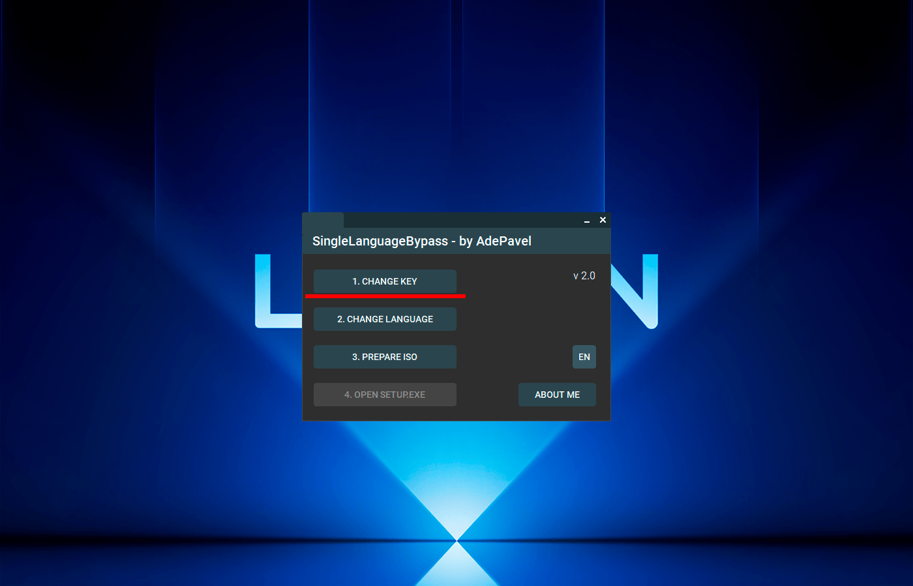
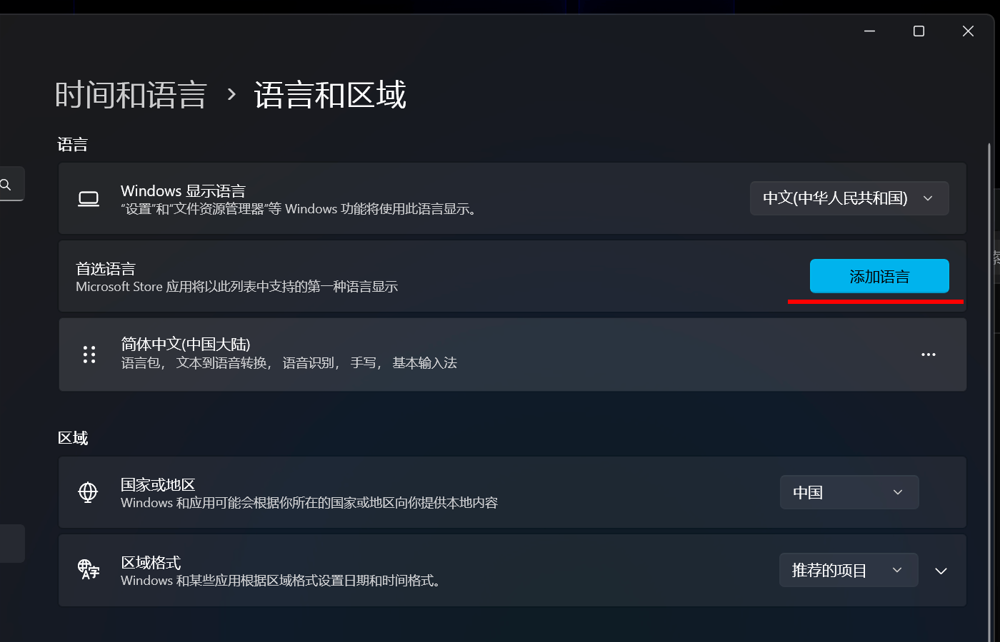
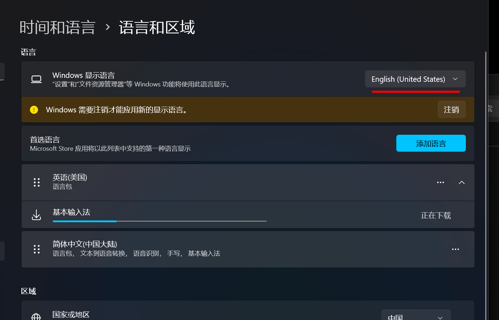
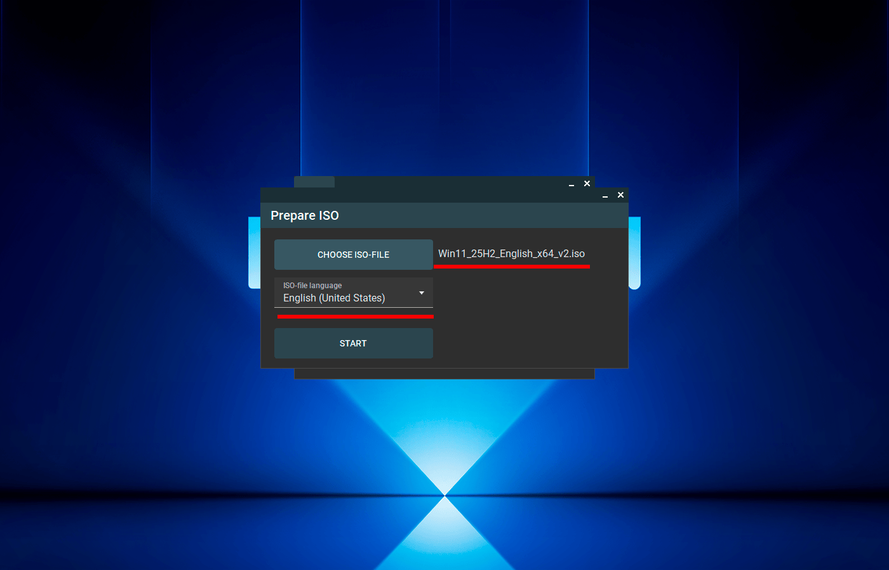
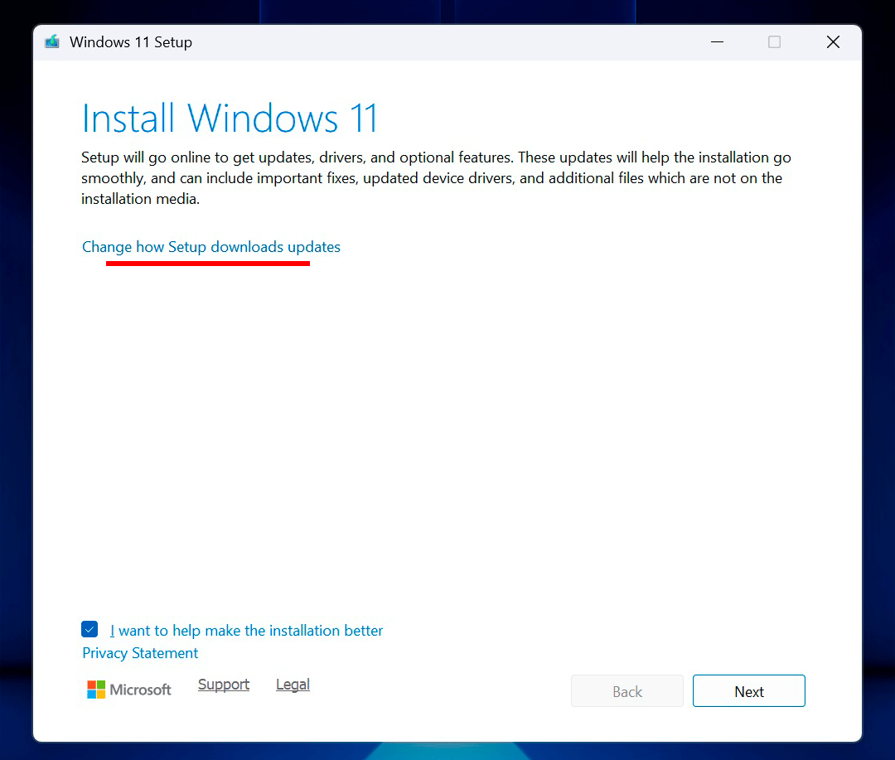

[English version](README.md)

# SingleLanguageBypass

**Простой способ обойти ограничение Single Language в Windows 11 Single Language Edition без полной переустановки системы.**

## Оглавление

- [Что делает программа](#-что-делает-программа)
- [Описание проблемы](#описание-проблемы)
- [Решение](#решение)
- [Для кого это полезно](#для-кого-полезно-приложение)
- [Как работает программа](#как-работает-программа)
- [Пошаговая инструкция](#-пошаговая-инструкция-по-использованию)
- [Важные советы и предупреждения](#️-важные-советы-и-предупреждения)
- [Лицензия](#лицензия)

---

## ✨ Что делает программа

Программа позволяет обновить Windows **Single Language Edition** до полноценной **Windows Home** с возможностью свободно менять язык интерфейса, **сохранив**:
- все установленные драйверы и программы
- все пользовательские файлы и настройки
- действующую официальную лицензию Windows

---

## Описание проблемы

При покупке нового ноутбука система часто идёт с установленной **Windows 11 Single Language Edition**. В такой редакции **нельзя сменить язык интерфейса** — он жёстко зафиксирован.

Единственным официальным способом **до этого момента** была **полная переустановка Windows**, что приводило к потере всех предустановленных заводских программ, необходимости заново ставить драйверы и большой трате времени.

---

## Решение

**SingleLanguageBypass** использует **уникальный алгоритм** (полностью разработанный мной и ранее нигде не публиковавшийся), который позволяет обновить редакцию системы до Windows Home **с сохранением всех драйверов, приложений и данных**.

Всё происходит быстро и с минимальным участием пользователя.

---

## Для кого это полезно

- **Обычным пользователям**, которые не хотят тратить время и силы на полную переустановку Windows с последующей ручной установкой всех драйверов.
- **Магазинам ноутбуков и сервисным центрам** — для быстрой автоматизированной установки нужного языка интерфейса своим клиентам.

---

## Как работает программа

1. Смена ключа Windows на официальный Generic-ключ Home
2. Установка языкового пакета через стандартные настройки Windows
3. Монтирование ISO-образа и копирование файлов на рабочий стол
4. Настройка реестра под выбранный язык
5. Перезагрузка и запуск `Setup.exe` → обновление до Home

---

## 📖 Пошаговая инструкция по использованию

**Система должна быть подключена к интернету!**

   **Подготовьте ISO-файл**  
   Скачайте официальный ISO Windows 11 с сайта Microsoft **на том языке**, который хотите установить.  
   [→ Скачать Windows 11 ISO](https://www.microsoft.com/en-us/software-download/windows11)

   **Шаг 1 — Смена ключа**  
   Запустите программу → нажмите **«1. Сменить ключ»**.  
   В открывшемся окне UAC переведите ползунок в самый нижний режим («Никогда не уведомлять»).  
   Ключ сменится автоматически. Компьютер **перезагрузится**.

   

   **Шаг 2 — Установка языкового пакета**  
   После перезагрузки нажмите **«2. Изменить язык»**.  
   Нажмите «Добавить язык», выберите нужный язык (он **должен совпадать** с языком ISO-файла).  
   Отключите рукописный и голосовой ввод.  
   Поставьте галочку **«Установить как основной язык»** и установите пакет.

   

   **Данный шаг можно считать выполненным, когда языковой пакет отобразится в списке:**

   

   **Шаг 3 — Подготовка ISO**  
   Нажмите **«3. Подготовить ISO»**.  
   Выберите скачанный ISO-файл и соответствующий язык → нажмите **«Начать»**.  
   Программа скопирует файлы на рабочий стол и настроит реестр. Согласитесь на перезагрузку.

   

   **Шаг 4 — Обновление системы**  
   После перезагрузки запустите `Setup.exe` с рабочего стола (или через кнопку **«4. Открыть Setup.exe»** в программе).  
   Следуйте инструкциям установщика для обновления до Windows Home.

   

---

## ⚠️ Важные советы и предупреждения

- **Языки должны строго совпадать**:  
  Язык ISO-файла = Язык языкового пакета = Язык, выбранный в программе на шаге 3.

- После шага 3 Windows может работать **нестабильно** — это нормально. Именно поэтому программа снижает уровень UAC заранее, чтобы избежать лишних багов.

- **После завершения** рекомендуется вернуть UAC в исходное положение.

- На шаге 4 **отключите проверку обновлений Windows** — процесс пройдёт значительно быстрее.

- **Используйте программу на свой страх и риск.**

---

## Лицензия

Проект распространяется под лицензией **MIT**.  
Подробности — в файле [LICENSE](LICENSE).

---

**Автор:** AdePavel  
**GitHub:** [github.com/AdePavel](https://github.com/AdePavel)
